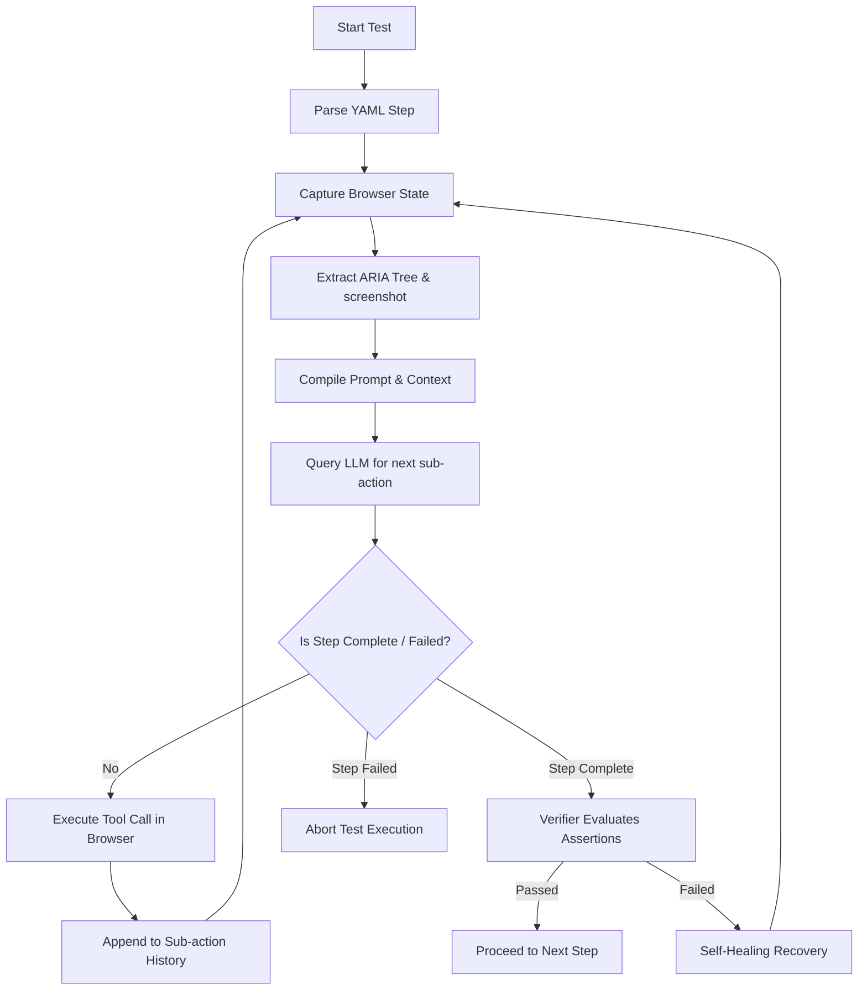

# Detailed Agent-QA Testing Workflow

This document provides a technical deep-dive into how **`agent-qa`** operates behind the scenes, referencing the actual codebase implementation (`packages/core/src/agent/`).

---

## 1. The Core Agent Loop (`loop.ts` & `runner.ts`)

When you run a test, the runner executes a state machine organized in loops:

### The Sub-Action Loop
For each step in a test (e.g. *Step 1/2: Verify the page says "Welcome"*), the runner does not just make one LLM call. It runs a **sub-action retry loop**:
1. **Observation**: Captures the current screenshot, viewport dimensions, and extracts the **ARIA accessibility tree** of the page.
2. **Ref Simplification**: To save tokens, the runner parses the DOM elements and replaces complex selectors/objects with simple tags like `[ref=e1]`, `[ref=e2]`, mapping back to the actual nodes.
3. **Execution**: Sends the system prompts, rule guides, previous sub-action history, variables, and screen state to the LLM.
4. **Action Dispatch**: The LLM returns a structured tool call (like `click(ref: 'e1')`, `fill(ref: 'e2', value: '...')`, `scroll()`, or `assert()`).
5. **Feedback Loop**: The tool result (e.g., `scrolled: true` or `element obscured`) is fed back into the sub-action history for the next iteration.

---

## 2. The Prompt Architecture (`prompts.ts`)

The system prompt defines a set of strict rules (Rules 1 to 21) that govern how the model must reason.

### A. Action Selection & Element Targeting
* **Rule 1 & 2**: Forces the LLM to choose the most specific action (e.g., `click` for buttons, `fill` for inputs) and **never guess/fabricate element references**.
* **Rule 9 & 10 (Element Bounding Boxes)**: If an element does not have a reference tag (`[ref=eN]`), the model uses coordinates annotated in the layout header (e.g., `@(x,y WxH)`) to perform a `tapCoordinate` at the center of the bounding box.

### B. The QA Mindset & Progress
* **Rule 13 (Always Move Forward)**: The model is told to break the instruction down into sub-goals and execute them in order without stopping or re-verifying intermediate results. For example: *"select Satellite and dismiss the panel"* means:
  * Sub-goal 1: Tap Satellite.
  * Sub-goal 2: Tap the close button immediately (do not wait or assert Satellite is selected first).

### C. Assertions & Mismatches
* **Rule 67 (Strict Literal Assertion)**: The model must assert the exact condition requested. If the instruction says *"verify 42 equals 30"*, the model must evaluate that it does **not** equal 30 and output `stepFailed: true`. The prompt states: *"This is QA — your job is to report truth, not make tests pass."*

---

## 3. The Self-Healing Process (`verifier.ts` & `asserter.ts`)

Self-healing triggers when the planner thinks a step is finished, but reality contradicts it.

### Step Complete Validation
When the model outputs `assert` with `stepComplete: true`, the runner triggers the **Verifier**:
* If `visual` is true (the default), the verifier performs visual checks on the browser state (ensuring target text is visible in the viewport and not obscured).
* If the verifier rejects the claim, the step is **not completed**, and a failure message is added to the model's history:
  > `"Step NOT complete: The target text was found but is obscured by a modal."`

### Progressive Escalation Recovery Recipe
Under **Rule 15**, when the model sees its assertion was rejected in the history, it must escalate:
1. **1st Rejection (Different Approach)**: Re-read the screen state and try a different selector, action, or path.
2. **2nd Rejection (Make It Visible)**: Scroll to bring content into view, dismiss modals/popups, or wait.
3. **3rd+ Rejection**: Admit defeat and call `stepFailed: true` with a clear explanation of what was attempted.

This structured self-correction loop is what allows the agent to handle dynamic loaders, overlays, or unexpected popups automatically without test code breaking.
